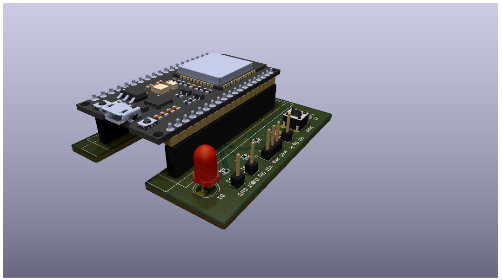

# Ethernet Latency Testplatform

Used to measure the time difference
within the Ethernet communication between
two uC's

Created for my Bachelor Thesis

## External Components

- [ESP32 WROOM32](https://www.amazon.de/dp/B0D8635YZ6)
- [LAN8720 Board](https://www.amazon.de/TECNOIOT-Ethernet-Transceiver-Interface-Development/dp/B07VN9Q4QK)

## ESP 32 Pinout

| GPIO | Function               |
|------|----------              |
|00    |RETCLK                  |
|12    |Output detection        |
|13    |Input detection         |
|14    |Master & Slave          |
|17    |NC		        		|
|18    |MDC                     |
|19    |TX 0                    |
|21    |TX Enable               |
|22    |TX 1                    |
|23    |MDIO                    |
|25    |RX 0                    |
|26    |RX  1                   |
|27    |CRS                     |

## Necessary Modifications

- Remove ClockGen from LAN8720 Board and use ESP32 as source
